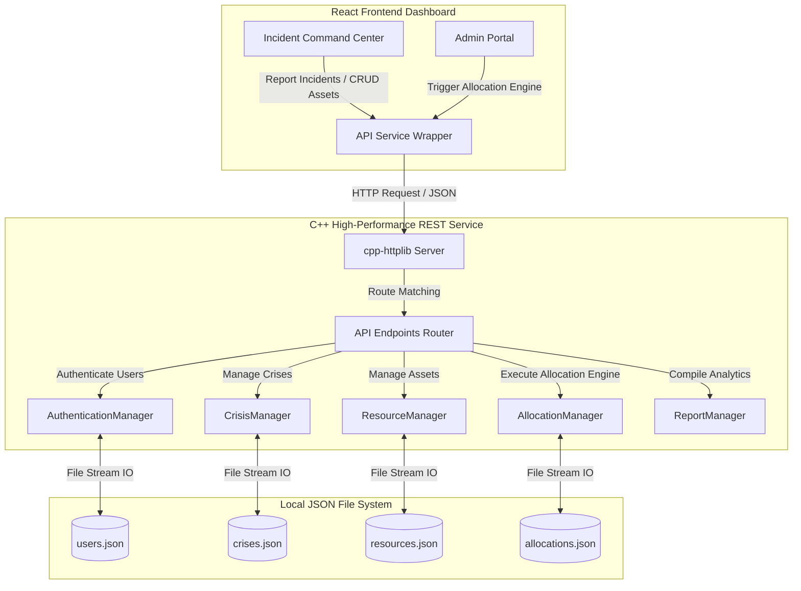
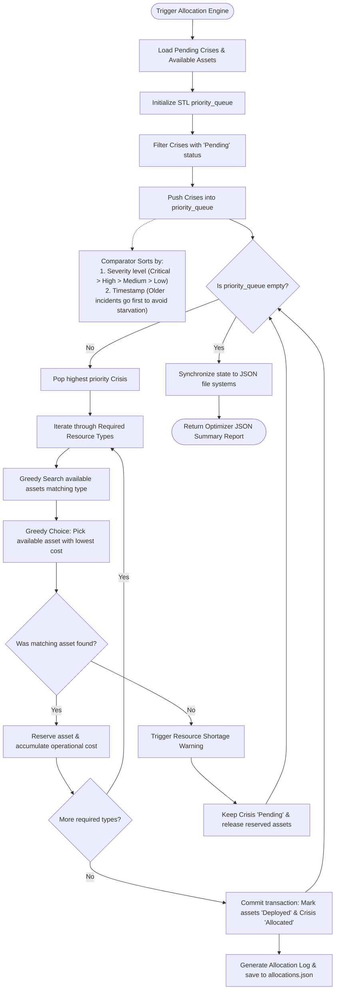
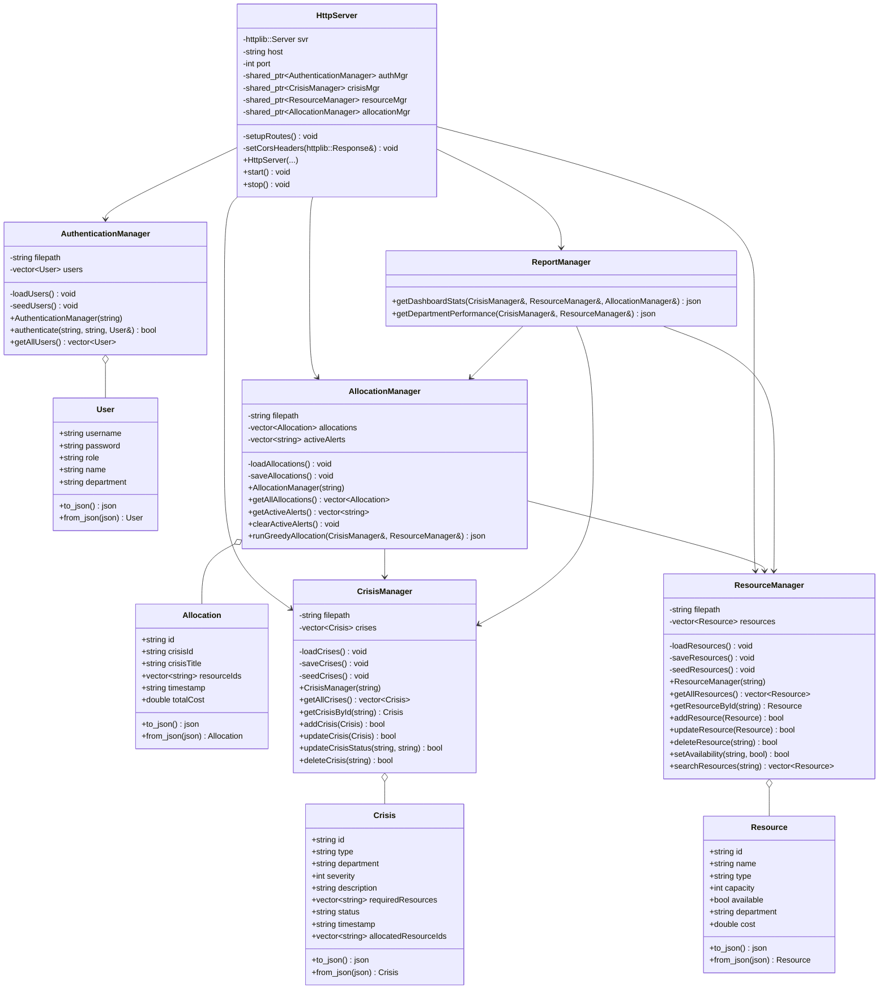

# Corporate Crisis Resource Allocation System (CCRAS)

An enterprise-grade, high-performance tactical incident management system that integrates a **modern, responsive React + TypeScript dashboard** with a **high-performance, multi-threaded C++ backend** featuring a priority-based greedy resource allocation engine.

---

## 🌟 Executive Overview
During operational crises (such as cybersecurity incidents, IT outages, infrastructure failures, or employee shortages), organization-wide resources must be audited, prioritized, and deployed with zero friction. 

**CCRAS** bridges the gap between high-level incident command and machine-level optimization. The frontend command center offers a stunning glassmorphic interface (with light/dark profiles) for incident reporting, asset tracking, and analytics. The backend C++ server manages the core data models, local JSON database synchronization, and executes a cost-optimized, priority-based greedy matching algorithm that handles high-concurrency requests with microsecond latency.

---

## 🛠️ Technology Stack
* **Backend Core**: Modern C++17 (MSYS2 GCC compiled)
* **REST API & Router**: Header-only `cpp-httplib`
* **JSON Processing Engine**: Header-only `nlohmann/json`
* **Networking Driver**: Native Windows Sockets (`ws2_32`)
* **Persistence Layer**: Structured offline-first JSON file databases (`data/*.json`)
* **Frontend Web Application**: React 18, Vite, TypeScript 5
* **Styling**: Harmonics HSL Vanilla CSS with unified CSS Custom Variables
* **Icons Package**: Lucide-React

---

## 📐 Architecture Diagrams

### 1. System Integration Pipeline


### 2. Core Priority-Based Greedy Allocation Flowchart


### 3. UML Class Diagram


---

## 🗂️ Project Directory Structure
```
Corporate Crisis Resource Allocation/
├── backend/
│   ├── include/
│   │   ├── httplib.h              # C++ REST API Server Library
│   │   └── json.hpp               # C++ JSON Parser/Serializer Library
│   ├── src/
│   │   ├── models/
│   │   │   ├── User.h             # Auth Model
│   │   │   ├── Crisis.h           # Tactical Incident Model
│   │   │   ├── Resource.h         # Resource Asset Model
│   │   │   └── Allocation.h       # Allocation Log Transaction Model
│   │   ├── managers/
│   │   │   ├── AuthenticationManager.h / .cpp
│   │   │   ├── CrisisManager.h / .cpp
│   │   │   ├── ResourceManager.h / .cpp
│   │   │   ├── AllocationManager.h / .cpp  # Core DSA Priority Allocation
│   │   │   └── ReportManager.h / .cpp      # Tactical Scorecards
│   │   ├── server/
│   │   │   ├── HttpServer.h / .cpp        # JSON Endpoints Router & CORS
│   │   │   └── main.cpp                    # Application Entry Bootloader
│   │   ├── data/
│   │   │   ├── users.json                 # Offline database seed
│   │   │   ├── crises.json
│   │   │   └── resources.json
│   │   └── build.bat              # Custom compiling script (g++)
├── frontend/
│   ├── src/
│   │   ├── assets/
│   │   ├── components/
│   │   │   ├── Sidebar.tsx        # Navigation & User info badge
│   │   │   └── Header.tsx         # Dark Mode switch, date display
│   │   ├── pages/
│   │   │   ├── Login.tsx          # Prefilled Demo credentials portal
│   │   │   ├── Dashboard.tsx      # Command center with manual optimizer
│   │   │   ├── CrisisManagement.tsx # Log outages/crises & resolve
│   │   │   ├── ResourceManagement.tsx # CRUD assets & search
│   │   │   └── Reports.tsx        # Print scorecard audit trails
│   │   ├── services/
│   │   │   └── api.ts             # Services layer connecting to C++ server
│   │   ├── App.tsx                # Context router & layout manager
│   │   ├── main.tsx               # Root DOM mounting
│   │   └── index.css              # Glassmorphic Custom HSL CSS Variables
│   ├── package.json
│   ├── tsconfig.json
│   └── vite.config.ts
└── README.md                      # Complete system documentation
```

---

## 🗄️ Database Schemas (JSON Formats)

### 1. Crises Logs (`data/crises.json`)
```json
[
    {
        "id": "C-1001",
        "type": "Cybersecurity Incident",
        "department": "Security",
        "severity": 4,
        "description": "Ransomware outbreak detected on main database server.",
        "requiredResources": ["Security Teams", "Backup Systems"],
        "status": "Allocated",
        "timestamp": "2026-05-25T10:15:00Z",
        "allocatedResourceIds": ["R-2001", "R-2002"]
    }
]
```

### 2. Corporate Assets (`data/resources.json`)
```json
[
    {
        "id": "R-2001",
        "name": "Cyber Incident Response Team (CIRT)",
        "type": "Security Teams",
        "capacity": 5,
        "available": false,
        "department": "Security",
        "cost": 150.0
    }
]
```

---

## 🚀 Setup & Execution Instructions

### 📋 Prerequisites
1. **GCC Compiler** (G++ supporting C++17) installed in your Windows Path (such as MSYS2 or MinGW).
2. **Node.js** (v18 or higher) & **npm** installed on your workstation.

---

### 💻 1. Compile & Start C++ Backend Server
1. Open Windows PowerShell and navigate to the `backend` directory:
   ```powershell
   cd backend
   ```
2. Execute the compilation batch file:
   ```powershell
   .\build.bat
   ```
   *This compiles all source modules, defines Windows 10 targeting macro `-D_WIN32_WINNT=0x0A00`, links standard sockets library `-lws2_32`, and creates the native executable `crisis_server.exe`.*
3. Run the backend server:
   ```powershell
   .\crisis_server.exe
   ```
   *The server initializes managers, creates database backup seed files under `data/`, and begins listening on `http://127.0.0.1:8080`.*

---

### 💻 2. Install & Start React Frontend Client
1. Open a separate terminal or split your console, and navigate to the `frontend` folder:
   ```powershell
   cd frontend
   ```
2. Install npm packages:
   ```powershell
   npm install
   ```
3. Boot the local development server:
   ```powershell
   npm run dev
   ```
4. Access the web dashboard by navigating to the URL displayed in the console (usually `http://localhost:5173`).

---

## 🔌 REST API Documentation

### 🔓 1. User Authentication
* **Endpoint**: `POST /api/login`
* **Description**: Verifies credentials and issues session mock token.
* **Payload**:
  ```json
  { "username": "admin", "password": "admin123" }
  ```
* **Response (200 OK)**:
  ```json
  {
    "success": true,
    "token": "demo_session_token_admin",
    "user": { "username": "admin", "role": "admin", "name": "System Administrator", "department": "IT Operations" }
  }
  ```

### 🚨 2. Crisis Incidents
* **Endpoint**: `GET /api/crises`
  * **Response**: Array of logged crises.
* **Endpoint**: `POST /api/crises`
  * **Description**: Logs a new incident in `Pending` status.
  * **Payload**:
    ```json
    {
      "type": "IT Outage",
      "department": "Operations",
      "severity": 3,
      "description": "Logistics cloud tracker API failing to process routes.",
      "requiredResources": ["IT Staff"]
    }
    ```
* **Endpoint**: `PUT /api/crises/resolve/:id`
  * **Description**: Marks the crisis `Resolved` and releases all assigned assets back to `Available = true` immediately in real-time.

### 💼 3. Resource Management
* **Endpoint**: `GET /api/resources?q=query`
  * **Description**: Returns all assets, supporting fuzzy searches using `q`.
* **Endpoint**: `POST /api/resources` (Register new asset).
* **Endpoint**: `PUT /api/resources/:id` (Edit asset details).
* **Endpoint**: `DELETE /api/resources/:id` (Deregister asset from registry).

### ⚙️ 4. Trigger Allocation Engine
* **Endpoint**: `POST /api/allocate`
* **Description**: Triggers C++ core priority allocation greedy engine. It processes pending crises in priority queue order, pairs them with cheap available assets, generates shortages alerts, and updates databases.

### 📊 5. Tactical Scorecards & Analytics
* **Endpoint**: `GET /api/dashboard/stats` (Returns counts, cost totals, and active shortages alerts).
* **Endpoint**: `GET /api/reports/performance` (Returns department operational resolution scores and full allocation audit lists).

---

## 📚 DSA & OOP Architectural Concepts

### 1. Data Structures & Algorithms (DSA)
* **Priority Queue (`std::priority_queue`)**: Critical crises must receive immediate tactical resolution. The system builds an STL `std::priority_queue` sorting crises by **severity** (4 = Critical down to 1 = Low). To prevent **thread-starvation** where a low-severity crisis remains pending forever, our custom comparator fallback sorts by **timestamp** (older incidents go first if severity matches), modeling a strict FIFO scheduler for identical weight boundaries.
* **Greedy Allocation**: To optimally assign resources under economic constraints, CCRAS runs a greedy allocator. For every asset required by a popped high-priority crisis, it scans available assets of that type and allocates the **lowest-cost asset** first, guaranteeing a cost-minimized operational solution.
* **Hash Maps (`std::map`)**: Utilized in `ReportManager` to group active incidents by department and compute resolution rates and operating cost indices with $O(N \log M)$ execution boundaries.

### 2. Object-Oriented Design (OOP)
* **Encapsulation**: Managers (such as `CrisisManager`) encapsulate internal `std::vector` vectors and private I/O file streams. State mutations can only be triggered via public APIs (e.g. `addCrisis`).
* **Abstraction**: Managers present clean semantic models (e.g. `runGreedyAllocation`) shielding complex network pre-filters, priority queues, and sorting operations from callers.
* **Polymorphism & Modular Design**: Classes are designed to maintain independent domain bounds, simplifying dependency injections inside our high-performance HTTP server launcher.

---

## 🎓 Viva Questions and Answers

### C++ & OOP Concepts

#### Q1: What OOP principles are demonstrated in the CCRAS architecture?
**A:** 
1. **Encapsulation**: Data members of `Crisis` and `Resource` are bundled with serialization methods (`to_json` / `from_json`). Managers keep resource vectors private, exposing mutations strictly via public getters/setters.
2. **Abstraction**: The `AllocationManager::runGreedyAllocation` abstracts the complexity of priority queue sorting and greedy resource cost optimization.
3. **Modularity**: Separation of concerns. Endpoints are mapped inside `HttpServer`, business logic is compiled inside managers, and data structures are configured inside models.

#### Q2: What is the purpose of `#pragma once` at the top of your header files?
**A:** It is a preprocessor directive that acts as a header guard. It ensures the header file is included exactly once during compilation, preventing "duplicate definition" compilation errors and speeding up build compile times.

#### Q3: Why did you use `std::shared_ptr` instead of raw pointers in `HttpServer`?
**A:** `std::shared_ptr` is a smart pointer in C++ that manages the lifetime of dynamically allocated objects using **reference counting**. Using smart pointers prevents memory leaks. Once the reference count of managers hits zero (e.g., when the server shuts down), memory is automatically deallocated.

#### Q4: Explain the difference between inheritance and composition in C++. Which is preferred in CCRAS?
**A:** **Inheritance** represents an "is-a" relationship (deriving a child class from a parent class). **Composition** represents a "has-a" relationship (embedding objects of other classes as member variables). CCRAS prefers **composition**—the `HttpServer` has references to managers, and managers compose vectors of models, offering greater decoupling and flexibility.

#### Q5: What is the difference between a `struct` and a `class` in C++?
**A:** In C++, the only difference is the default access specifier. Member variables/methods of a `struct` are `public` by default, whereas in a `class` they are `private` by default. We used `struct` for data-centric models (`Crisis`, `Resource`) and `class` for controller layers (`CrisisManager`, `HttpServer`).

---

### Data Structures & Algorithms (DSA)

#### Q6: Why is `std::priority_queue` the optimal choice for sorting crises in CCRAS?
**A:** A standard array or list requires $O(N \log N)$ sorting time whenever a new crisis is logged. A `std::priority_queue` (implemented as a max-heap under the hood in the STL) allows us to insert a new incident in $O(\log N)$ time, and retrieve/pop the highest priority incident in $O(1)$ time, providing optimal scale-out performance.

#### Q7: Describe how your custom comparator `CrisisComparator` works.
**A:** The comparator defines the priority order. It returns `true` if crisis `a` has lower priority than crisis `b`. 
1. First, it compares `severity` (Critical = 4 down to Low = 1). Higher severity has higher priority.
2. If severities are equal, it compares `timestamp` strings. The older timestamp (lexicographically smaller) receives higher priority. This prevents starvation of low-severity incidents.

#### Q8: What makes your resource allocation algorithm "Greedy"?
**A:** It is a greedy algorithm because at each step, it makes the locally optimal choice. When a crisis requires an asset type (e.g. "Backup Systems"), the engine scans all available assets of that type and immediately selects the one with the **lowest hourly cost**. It doesn't look ahead to future crises; it resolves the current highest-priority incident with the most cost-effective local asset.

#### Q9: What is the time complexity of the allocation algorithm?
**A:** Let $C$ be the number of active pending crises and $R$ be the number of registered resources. 
1. Filtering and pushing pending crises into the priority queue takes $O(C \log C)$ time.
2. Popping each crisis takes $O(\log C)$.
3. For each crisis, we iterate through its required types (at most a constant $K$) and scan the resource array, taking $O(R)$ time.
Thus, the overall time complexity is $O(C \log C + C \cdot R)$, which operates under a fraction of a millisecond for enterprise-scale volumes.

#### Q10: How do you handle resource starvation in your design?
**A:** Starvation occurs if minor incidents are continually pushed back by newer critical incidents. We mitigate this by checking timestamps in `CrisisComparator`. If two incidents have the same severity, the older incident (earlier timestamp) is prioritized, ensuring a fair FIFO boundary for equal severities.

---

### Operating Systems & Networking

#### Q11: How does the C++ backend handle multi-threading?
**A:** The `cpp-httplib` server runs on a multi-threaded socket driver. Every incoming HTTP request from the React frontend is dispatched on a separate worker thread from a thread pool. This allows the backend to handle multiple concurrent CRUD or allocation requests simultaneously.

#### Q12: Why did you link your backend against the `ws2_32` library in Windows?
**A:** `ws2_32.lib` is the Windows Sockets 2 library. In Windows, network sockets (TCP/IP communication) are not part of the standard C++ runtime library. To compile network code using headers like `winsock2.h` (used by `httplib.h`), we must link the compiler against `ws2_32` (`-lws2_32` flag) to resolve the underlying OS socket APIs.

#### Q13: What is CORS and why did you have to configure it in the C++ server?
**A:** **Cross-Origin Resource Sharing (CORS)** is an OS-level browser security standard. Browsers block scripts on one origin (e.g. React running on `localhost:5173`) from fetching resources from another origin (e.g. C++ server running on `localhost:8080`) unless the server explicitly sends headers allowing it. We configured CORS headers (`Access-Control-Allow-Origin: *`) on every response to allow our frontend to communicate with the backend.

#### Q14: Explain the difference between TCP and UDP. Which one does CCRAS use?
**A:** **TCP (Transmission Control Protocol)** is connection-oriented, reliable, guarantees packet ordering, and features error-checking. **UDP (User Datagram Protocol)** is connectionless, fast, but does not guarantee delivery or packet order. CCRAS uses **TCP** (running HTTP/1.1), ensuring no crucial crisis logs or resource updates are lost during transmission.

#### Q15: What is socket binding in networking?
**A:** Socket binding is the process where a socket is assigned a local IP address and port number. In `HttpServer.cpp`, `svr.listen("127.0.0.1", 8080)` binds the server socket to the loopback IP address `127.0.0.1` and port `8080`, reserving this address-port pair to receive incoming web traffic.

---

### System Design & Engineering

#### Q16: How does CCRAS guarantee data persistence?
**A:** Data is persisted in structural JSON files under `backend/data/` using standard C++ `std::ifstream` and `std::ofstream` file streams. Every time a crisis is created, resources are updated, or an allocation is committed, the backend immediately synchronizes its memory state with the JSON file database, ensuring no data is lost even if the backend process terminates.

#### Q17: What are the main benefits of a modular decoupled architecture?
**A:** Decoupled architecture separates the client interface (React) from the logic processor (C++). Benefits include:
1. **Language Optimization**: We use React for rich rapid UI development, and C++ for CPU-intensive, lightweight priority allocations.
2. **Scalability**: The C++ server can be hosted on a separate high-performance server, while the frontend is distributed globally via CDNs.
3. **Maintainability**: Changes in UI styling do not affect backend core calculations, and vice-versa.

#### Q18: What security measures would you add to CCRAS for production?
**A:**
1. **HTTPS**: Implement TLS encryption for both API endpoints and React hosting.
2. **Authentication Token Integration**: Instead of simple mock sessions, implement stateless JSON Web Tokens (JWT) encrypted with HMAC SHA-256.
3. **Input Sanitization**: Escape inputs to prevent buffer overflow attacks on the C++ side and Cross-Site Scripting (XSS) on the React side.
4. **Active Database Integration**: Migrate the JSON file database to a secure relational database (e.g., PostgreSQL or SQLite) using SQL parameterized queries.

#### Q19: How do you handle database write concurrency in the C++ server?
**A:** When multiple threads attempt to write to the same file database simultaneously, it can lead to data corruption. In a high-concurrency production setting, we would introduce a **Mutex lock** (`std::mutex`) inside the write pathways of our managers. This would serialize file-writes, guaranteeing that only one thread updates a JSON file at a time (Mutual Exclusion).

#### Q20: If you had to scale CCRAS to handle 1 million active crises, how would you design it?
**A:**
1. **Database Partitioning & Indexing**: Use a high-performance database with indexes on `severity`, `status`, and `timestamp`.
2. **Distributed Priority Queue**: Use an external memory-cached broker like **Redis** sorted sets to manage the priority queue globally.
3. **Horizontal Scaling**: Deploy the C++ backend as multiple microservices behind an Nginx load balancer.
4. **Web Sockets**: Replace HTTP polling with persistent duplex WebSockets to deliver crisis shortage alarms and live ticks instantly to frontend clients.
